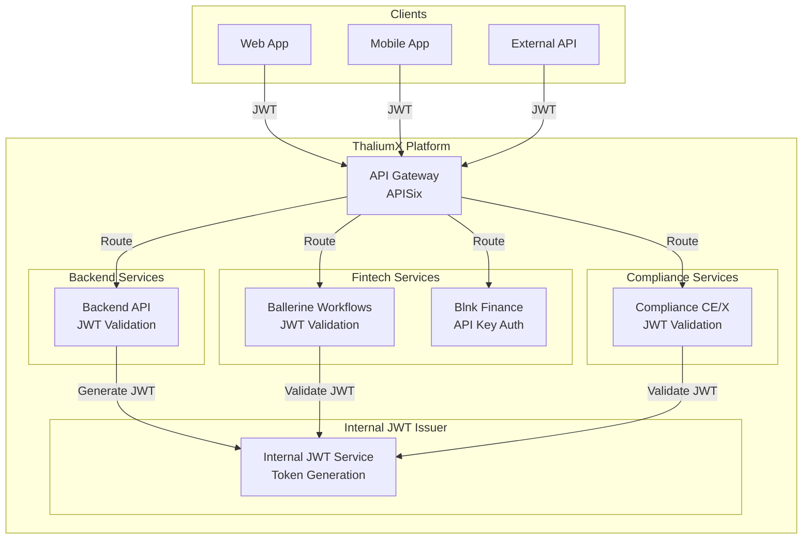

# JWT Migration and Security Fix Plan - ThaliumX

## Document Information

- **Created:** 2026-03-16
- **Version:** 1.0
- **Status:** Action Plan

---

## Executive Summary

This document outlines the comprehensive migration plan to remove Keycloak, Zitadel, and Authentik identity providers, replacing them with a unified internal JWT-only architecture. Additionally, it addresses the **47 identified security issues** organized by priority.

### Key Objectives

1. Remove all external identity provider dependencies (Keycloak, Zitadel, Authentik)
2. Implement a unified JWT authentication system across all services
3. Fix all critical and high-priority security vulnerabilities
4. Simplify the authentication infrastructure

---

## 1. JWT Migration Plan

### 1.1 Current Architecture Analysis

The current system uses multiple identity providers:

| Service | Identity Provider | JWT Configuration |
|---------|-------------------|-------------------|
| Backend API | Authentik + internal JWT | `JWT_SECRET`, `AUTHENTIK_ISSUER` |
| Ballerine Workflows | Zitadel | `ZITADEL_JWKS_URI`, `ZITADEL_ISSUER` |
| Blnk Finance | Internal API Keys | `BLNK_SECRET_KEY` |
| Compliance Services | Authentik | `AUTHENTIK_JWKS_URI` |

### 1.2 Target Architecture (JWT-Only)



### 1.3 Files Requiring Modification

#### Docker Compose Files (Remove Identity Services)

| File | Action | Description |
|------|--------|-------------|
| `docker/compose/prod-v1/identity.yml` | DELETE | Authentik identity service |
| `docker/compose/prod-v1/fintech.yml` | MODIFY | Remove Authentik/Zitadel env vars |
| `docker/compose/prod-v1/core.yml` | MODIFY | Remove identity service dependencies |
| `docker/compose/prod-v1/production.yml` | MODIFY | Remove identity compose references |
| `docker/compose/prod-v1/base.yml` | MODIFY | Remove identity network definitions |
| `docker/compose/prod-v1/applications.yml` | MODIFY | Update routes (remove identity routes) |
| `docker/compose/prod-v1/gateway.yml` | MODIFY | Remove identity upstream definitions |
| `k8s/helm/thaliumx/values.yaml` | MODIFY | Remove Authentik helm configuration |

#### Backend JWT Configuration Files

| File | Action | Changes |
|------|--------|---------|
| `docker/backend/src/services/config.ts` | MODIFY | Remove Authentik config, force internal-jwt |
| `docker/backend/src/services/config-enhanced.ts` | MODIFY | Remove Authentik validation |
| `docker/backend/src/services/token-service.ts` | MODIFY | Ensure internal JWT is default |
| `docker/backend/src/middleware/error-handler.ts` | MODIFY | Remove Authentik JWT provider logic |
| `docker/backend/src/utils/index.ts` | MODIFY | Remove Authentik-specific JWT logic |
| `docker/backend/src/types/index.ts` | MODIFY | Update auth provider types |
| `docker/backend/src/services/database.ts` | MODIFY | Remove authentikId column references |
| `docker/backend/src/migrations/010-align-users-schema-to-model.ts` | MODIFY | Update migration for internal JWT |
| `docker/backend/src/migrations/012-zitadel-migration.ts` | MODIFY | Update migration for internal JWT |
| `docker/backend/src/services/authentik.ts` | DELETE or DEPRECATE | Remove Authentik service |
| `docker/backend/src/services/authentik-attributes.service.ts` | DELETE | Remove Authentik attributes |
| `docker/backend/src/services/zitadel-api.service.ts` | DELETE | Remove Zitadel API service |
| `docker/backend/src/services/zitadel-attributes.service.ts` | DELETE | Remove Zitadel attributes |

#### Backend Environment Files

| File | Action | Changes |
|------|--------|---------|
| `docker/.env` | MODIFY | Remove Authentik/Zitadel env vars |
| `docker/backend/.env.example` | MODIFY | Remove identity provider examples |
| `docker/compose/prod-v1/core.env` | MODIFY | Remove identity variables |
| `docker/compose/prod-v1/trading.env` | MODIFY | Remove identity variables |
| `docker/compose/prod-v1/wazuh.env` | MODIFY | Remove identity variables |

#### Ballerine Workflows Service Files

| File | Action | Changes |
|------|--------|---------|
| `ballerine/services/workflows-service/src/env.ts` | MODIFY | Remove Zitadel/Authentik env vars |
| `ballerine/services/workflows-service/src/auth/auth.module.ts` | MODIFY | Remove Zitadel strategy |
| `ballerine/services/workflows-service/src/auth/zitadel/zitadel.strategy.ts` | DELETE | Remove Zitadel strategy |
| `ballerine/services/workflows-service/src/auth/zitadel/zitadel-auth.service.ts` | DELETE | Remove Zitadel auth service |
| `ballerine/services/workflows-service/src/common/middlewares/zitadel-auth.middleware.ts` | DELETE | Remove Zitadel middleware |
| `ballerine/services/workflows-service/src/app.module.ts` | MODIFY | Remove Zitadel imports |

#### Blnk Finance Service Files

| File | Action | Changes |
|------|--------|---------|
| `blnk/config/config.go` | MODIFY | Force Secure=true in production |
| `blnk/api/middleware/auth.go` | MODIFY | Remove Secure=false bypass |
| `blnk/docker-compose.dev.yaml` | MODIFY | Remove dev credentials |
| `blnk/docker-compose.yaml` | MODIFY | Ensure production security |

#### Compliance Services

| File | Action | Changes |
|------|--------|---------|
| `docker/compliance/compose.yaml` | MODIFY | Remove Authentik env vars |
| `docker/compliance-cex/src/middleware/auth.ts` | MODIFY | Remove Authentik auth |

### 1.4 Ballerine Workflows Service JWT Migration

The Ballerine workflows service currently uses Zitadel for authentication. Migration steps:

#### Step 1: Environment Variable Updates

```bash
# Remove Zitadel-specific variables
unset ZITADEL_JWKS_URI
unset ZITADEL_ISSUER
unset ZITADEL_AUDIENCE
unset ZITADEL_ALLOWED_ROLES
unset ZITADEL_ALLOWED_EMAIL_DOMAINS
unset ZITADEL_USER_CREATION_RATE_LIMIT
unset ZITADEL_REQUIRE_ADMIN_APPROVAL

# Add unified JWT configuration
export JWT_SECRET_KEY=<secure-random-256-bit-key>
export JWT_ISSUER=https://api.thaliumx.com
export JWT_AUDIENCE=thaliumx-workflows
```

#### Step 2: Strategy Replacement

1. Remove `ZitadelStrategy` from `auth.module.ts`
2. Create or extend internal JWT strategy
3. Update middleware to use internal JWT only
4. Configure JWKS endpoint for token validation

#### Step 3: User Migration

Existing users with `zitadel_id` need to be migrated:
- Map existing `zitadel_id` to internal `user_id`
- Create new internal JWT claims structure
- Maintain backward compatibility during transition

### 1.5 Unified JWT Configuration

All services will use the same JWT configuration:

| Environment Variable | Description | Example |
|---------------------|-------------|---------|
| `JWT_SECRET_KEY` | HMAC signing key (256-bit min) | `<secure-random>` |
| `JWT_ISSUER` | Token issuer URL | `https://api.thaliumx.com` |
| `JWT_AUDIENCE` | Expected audience | `thaliumx-platform` |
| `JWT_EXPIRY_ACCESS` | Access token expiry | `15m` |
| `JWT_EXPIRY_REFRESH` | Refresh token expiry | `7d` |
| `JWT_ALGORITHM` | Signing algorithm | `HS256` |

---

## 2. Security Fixes Priority List

### 2.1 CRITICAL (Immediate - Within 24 Hours)

| # | Issue | File | Lines | Remediation |
|---|-------|------|-------|-------------|
| 1.1 | Hardcoded secrets in docker/.env | `docker/.env` | 9-153 | Move to Docker secrets or Vault |
| 1.2 | DISABLE_RATE_LIMIT bypass | `docker/backend/src/middleware/rate-limiter.ts` | 62,166,233,286,349 | Remove bypass, keep test only |
| 1.2 | DISABLE_RATE_LIMIT bypass | `docker/backend/src/middleware/error-handler.ts` | 187,243,277,293 | Remove bypass |
| 1.2 | DISABLE_RATE_LIMIT bypass | `docker/backend/src/middleware/threat-detection.ts` | 296 | Remove bypass |
| 1.3 | Weak JWT secrets | `docker/backend/.env.example` | 50 | Generate secure random |
| 1.3 | Weak JWT secrets | `docker/compose/prod-v1/trading-safe.yml` | 201 | Generate secure random |
| 1.4 | Default tokenization key | `blnk/config/config.go` | 306-308 | Remove default, fail if missing |
| 1.5 | Server.Secure can be disabled | `blnk/config/config.go` | 284-289 | Force Secure=true in prod |
| 1.5 | Auth bypass when Secure=false | `blnk/api/middleware/auth.go` | 197-200 | Prevent Secure=false in prod |

### 2.2 HIGH (This Week)

| # | Issue | File | Lines | Remediation |
|---|-------|------|-------|-------------|
| 2.1 | Vault tokens in compose files | `docker/compose/prod-v1/trading-safe.yml` | 27,31,35,44,90 | Use Docker secrets |
| 2.2 | Weak dev credentials | `docker/backend/docker-compose.dev.yml` | 12,55 | Generate strong passwords |
| 2.2 | Weak dev credentials | `docker/backend/.env.example` | 31,42,60 | Generate strong passwords |
| 2.2 | Weak dev credentials | `blnk/docker-compose.dev.yaml` | 71 | Generate strong password |
| 2.3 | Ballerine hardcoded secrets | `docker/compose/prod-v1/fintech.yml` | 75-86 | Use Docker secrets |
| 2.4 | DB credentials in URLs | `docker/.env` | 126-128 | Use env var substitution |

### 2.3 MEDIUM (This Sprint)

| # | Issue | File | Remediation |
|---|-------|------|-------------|
| 3.1 | Add docker/.env to .gitignore | `.gitignore` | Add entry |
| 3.2 | Implement Docker secrets | Multiple compose files | Migrate all secrets |
| 3.3 | Add startup validation for secrets | `blnk/config/config.go`, `docker/backend/src/config/` | Fail fast validation |
| 3.4 | Review and audit env variables | All env files | Categorize and secure |

### 2.4 LOW (Backlog)

| # | Issue | File | Remediation |
|---|-------|------|-------------|
| 3.5 | Security headers verification | `docker/backend/src/middleware/error-handler.ts` | Test and verify |

---

## 3. Implementation Steps

### Phase 1: Critical Security Fixes (Day 1)

#### Step 1.1: Remove Hardcoded Secrets

```bash
# 1. Add docker/.env to .gitignore
echo "docker/.env" >> .gitignore

# 2. Move all secrets to Docker secrets or Vault
# Create secret files in .secrets/generated/
```

#### Step 1.2: Remove Rate Limit Bypass

```typescript
// In rate-limiter.ts, error-handler.ts, threat-detection.ts
// REMOVE all instances of:
// process.env.DISABLE_RATE_LIMIT === 'true'

// KEEP only:
// process.env.NODE_ENV === 'test'
```

#### Step 1.3: Fix JWT Secrets

```bash
# Generate secure JWT secret (256-bit minimum)
openssl rand -base64 32
```

#### Step 1.4: Fix Blnk Security

```go
// In blnk/config/config.go
// REMOVE default tokenization key
// ADD validation to fail in production if secrets missing

// In blnk/api/middleware/auth.go  
// ADD validation to fail if Secure=false in production
```

### Phase 2: Identity Service Removal (Days 2-3)

#### Step 2.1: Remove Authentik from Docker Compose

1. Delete `docker/compose/prod-v1/identity.yml`
2. Remove Authentik references from `production.yml`
3. Remove Authentik network from `base.yml`
4. Update `gateway.yml` to remove Authentik routes

#### Step 2.2: Update Backend JWT Configuration

1. Modify `docker/backend/src/services/config.ts`:
   - Remove Authentik configuration block
   - Force `authProvider: 'internal-jwt'`
   - Add JWT secret validation

2. Modify `docker/backend/src/middleware/error-handler.ts`:
   - Remove Authentik JWT provider
   - Use internal JWT only

#### Step 2.3: Remove Backend Authentik Services

1. Delete or deprecate:
   - `docker/backend/src/services/authentik.ts`
   - `docker/backend/src/services/authentik-attributes.service.ts`
   - `docker/backend/src/services/zitadel-api.service.ts`
   - `docker/backend/src/services/zitadel-attributes.service.ts`

2. Update imports in affected files

#### Step 2.4: Update Ballerine Workflows Service

1. Remove Zitadel strategy and service files
2. Update `env.ts` to use unified JWT config
3. Modify `auth.module.ts` to use internal JWT
4. Update middleware to validate internal JWT

### Phase 3: Blnk Security Fixes (Day 4)

#### Step 3.1: Force Authentication

```go
// In blnk/config/config.go
func ValidateProductionConfig() error {
    if os.Getenv("NODE_ENV") == "production" && !cnf.Server.Secure {
        return errors.New("BLNK_SERVER_SECURE must be true in production")
    }
    if cnf.Server.secretKey == "" {
        return errors.New("BLNK_SERVER_SECRET_KEY is required")
    }
    return nil
}
```

#### Step 3.2: Remove Default Tokenization Key

```go
// In blnk/config/config.go
// REMOVE: cnf.TokenizationSecret = "blnk-default-tokenization-key!!!!"
```

### Phase 4: Environment Cleanup (Day 5)

#### Step 4.1: Update All Environment Files

1. Remove identity provider variables:
   - `AUTHENTIK_ENABLED`
   - `AUTHENTIK_ISSUER`
   - `AUTHENTIK_JWKS_URI`
   - `AUTHENTIK_AUDIENCE`
   - `ZITADEL_JWKS_URI`
   - `ZITADEL_ISSUER`
   - `ZITADEL_AUDIENCE`
   - `KEYCLOAK_URL`
   - `KEYCLOAK_REALM`

2. Add unified JWT variables:
   - `JWT_SECRET_KEY`
   - `JWT_ISSUER`
   - `JWT_AUDIENCE`

#### Step 4.2: Update Docker Compose Files

1. Remove Authentik/Zitadel service definitions
2. Remove identity-related environment variables
3. Update secrets to use unified JWT

---

## 4. Detailed File Modification List

### 4.1 Files to DELETE

| File Path | Reason |
|-----------|--------|
| `docker/compose/prod-v1/identity.yml` | Authentik service definition |
| `ballerine/services/workflows-service/src/auth/zitadel/zitadel.strategy.ts` | Zitadel auth |
| `ballerine/services/workflows-service/src/auth/zitadel/zitadel-auth.service.ts` | Zitadel auth |
| `ballerine/services/workflows-service/src/common/middlewares/zitadel-auth.middleware.ts` | Zitadel middleware |
| `docker/backend/src/services/authentik.ts` | Authentik service |
| `docker/backend/src/services/authentik-attributes.service.ts` | Authentik attributes |
| `docker/backend/src/services/zitadel-api.service.ts` | Zitadel API |
| `docker/backend/src/services/zitadel-attributes.service.ts` | Zitadel attributes |

### 4.2 Files to MODIFY

| File Path | Modification Type | Key Changes |
|-----------|------------------|-------------|
| `docker/compose/prod-v1/production.yml` | Modify | Remove identity references |
| `docker/compose/prod-v1/base.yml` | Modify | Remove identity network |
| `docker/compose/prod-v1/gateway.yml` | Modify | Remove identity upstreams |
| `docker/compose/prod-v1/applications.yml` | Modify | Update routes |
| `docker/compose/prod-v1/fintech.yml` | Modify | Remove Authentik env vars |
| `docker/compose/prod-v1/core.yml` | Modify | Remove identity deps |
| `docker/compose/prod-v1/core.env` | Modify | Remove identity vars |
| `docker/.env` | Modify | Remove hardcoded secrets |
| `docker/backend/src/services/config.ts` | Modify | Force internal JWT |
| `docker/backend/src/services/config-enhanced.ts` | Modify | Remove Authentik |
| `docker/backend/src/middleware/error-handler.ts` | Modify | Remove Authentik |
| `docker/backend/src/services/token-service.ts` | Modify | Default internal JWT |
| `docker/backend/src/utils/index.ts` | Modify | Remove Authentik |
| `docker/backend/src/types/index.ts` | Modify | Update types |
| `ballerine/services/workflows-service/src/env.ts` | Modify | Remove Zitadel |
| `ballerine/services/workflows-service/src/auth/auth.module.ts` | Modify | Remove Zitadel |
| `ballerine/services/workflows-service/src/app.module.ts` | Modify | Remove Zitadel |
| `blnk/config/config.go` | Modify | Force Secure=true |
| `blnk/api/middleware/auth.go` | Modify | Prevent bypass |
| `blnk/docker-compose.dev.yaml` | Modify | Strong credentials |
| `blnk/docker-compose.yaml` | Modify | Production security |
| `docker/compliance/compose.yaml` | Modify | Remove Authentik |
| `docker/compliance-cex/src/middleware/auth.ts` | Modify | Remove Authentik |
| `k8s/helm/thaliumx/values.yaml` | Modify | Remove Authentik |
| `.gitignore` | Modify | Add docker/.env |

### 4.3 Files to CREATE

| File Path | Purpose |
|-----------|---------|
| `.secrets/generated/jwt-secret` | Secure JWT signing key |
| `docker/secrets/jwt-secret-key` | Docker secret for JWT |
| `plans/JWT_MIGRATION_CHECKLIST.md` | Migration verification checklist |

---

## 5. Environment Variable Cleanup

### 5.1 Variables to REMOVE

```bash
# Authentik
AUTHENTIK_ENABLED
AUTHENTIK_ISSUER
AUTHENTIK_JWKS_URI
AUTHENTIK_AUDIENCE
AUTHENTIK_CLIENT_ID
AUTHENTIK_ALLOWED_EMAIL_DOMAINS
AUTHENTIK_REQUIRE_ADMIN_APPROVAL
AUTHENTIK_USER_CREATION_RATE_LIMIT
AUTHENTIK_ALLOWED_ROLES

# Zitadel
ZITADEL_JWKS_URI
ZITADEL_ISSUER
ZITADEL_AUDIENCE
ZITADEL_ALLOWED_ROLES
ZITADEL_ALLOWED_EMAIL_DOMAINS
ZITADEL_USER_CREATION_RATE_LIMIT
ZITADEL_REQUIRE_ADMIN_APPROVAL

# Keycloak
KEYCLOAK_URL
KEYCLOAK_REALM
KEYCLOAK_CLIENT_ID
KEYCLOAK_CLIENT_SECRET
```

### 5.2 Variables to ADD/UNIFY

```bash
# Unified JWT Configuration (all services)
JWT_SECRET_KEY=<secure-256-bit-key>
JWT_ISSUER=https://api.thaliumx.com
JWT_AUDIENCE=thaliumx-platform
JWT_ALGORITHM=HS256
JWT_EXPIRY_ACCESS=15m
JWT_EXPIRY_REFRESH=7d

# Keep for internal services
AUTH_PROVIDER=internal-jwt
```

---

## 6. Migration Checklist

### Pre-Migration
- [ ] Backup all databases
- [ ] Document current authentication flow
- [ ] Test rollback procedure
- [ ] Notify users of maintenance window

### During Migration
- [ ] Deploy critical security fixes
- [ ] Remove identity services from compose
- [ ] Update backend JWT configuration
- [ ] Update Ballerine JWT configuration
- [ ] Fix Blnk security issues
- [ ] Update all environment variables
- [ ] Test authentication flow
- [ ] Verify authorization rules

### Post-Migration
- [ ] Verify all services start correctly
- [ ] Test user login flow
- [ ] Test API authentication
- [ ] Verify audit logs capture auth events
- [ ] Monitor for authentication errors
- [ ] Update documentation

---

## 7. Rollback Plan

If migration fails:

1. **Revert Docker Compose:**
   ```bash
   git checkout docker/compose/prod-v1/identity.yml
   ```

2. **Revert Backend Changes:**
   ```bash
   git checkout docker/backend/src/services/config.ts
   git checkout docker/backend/src/middleware/error-handler.ts
   ```

3. **Restore Environment Variables:**
   - Restore Authentik/Zitadel environment variables
   - Restore previous JWT configuration

4. **Database Rollback:**
   - No database migrations required for auth provider change
   - Users remain with existing IDs

---

## 8. Testing Strategy

### Unit Tests
- Test JWT token generation with new configuration
- Test token validation with internal JWT
- Test Blnk authentication with Secure=true

### Integration Tests
- Test full login flow
- Test API authentication via JWT
- Test token refresh flow
- Test authorization rules

### Security Tests
- Verify no authentication bypasses
- Verify rate limiting is enforced
- Verify secrets are not exposed in logs

---

## 9. Related Documents

- [plans/SECURITY_REMEDIATION_PLAN.md](./SECURITY_REMEDIATION_PLAN.md) - Original security issues list
- [AUTHENTIK_MIGRATION_CHECKLIST.md](./AUTHENTIK_MIGRATION_CHECKLIST.md) - Previous migration work
- [docker/compose/prod-v1/identity.yml](./docker/compose/prod-v1/identity.yml) - Current identity config

---

*Document Version: 1.0*
*Last Updated: 2026-03-16*
