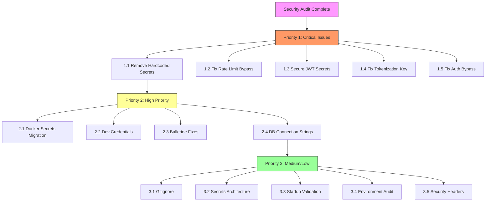

# Security Remediation Plan - ThaliumX

## Executive Summary

This document outlines the prioritized remediation plan for **47 security issues** identified in the ThaliumX codebase audit. Issues are categorized by priority with specific file paths, line numbers, effort estimates, and risk levels.

---

## Priority 1: CRITICAL (Immediate - Within 24 Hours)

These issues expose the system to immediate exploitation and must be fixed immediately.

### 1.1 Hardcoded Secrets in docker/.env

**Files & Lines:**
- [`docker/.env:9`](docker/.env:9) - `POSTGRES_PASSWORD=dW2QSkQnxJhaY2pP8mAt7YR9qtmbaHZ7`
- [`docker/.env:13`](docker/.env:13) - `CITUS_POSTGRES_PASSWORD`
- [`docker/.env:17`](docker/.env:17) - `TIMESCALE_PASSWORD`
- [`docker/.env:22`](docker/.env:22) - `MONGO_INITDB_ROOT_PASSWORD=003YPJRc4LKEAjGWJ5RPkQu5w51HNhJd`
- [`docker/.env:25`](docker/.env:25) - `REDIS_PASSWORD=NFqT8uZlru7Tw5cv8IHVll23BNHg2otS`
- [`docker/.env:30-31`](docker/.env:30) - `VAULT_DEV_ROOT_TOKEN_ID` and `VAULT_TOKEN`
- [`docker/.env:36-42`](docker/.env:36) - `JWT_SECRET`, `SESSION_SECRET`, `BLNK_SECRET_KEY`, etc.
- [`docker/.env:102-108`](docker/.env:102) - All Kafka passwords
- [`docker/.env:113-118`](docker/.env:113) - All Wazuh passwords

**Remediation:**
1. Move all secrets to Docker secrets or external secrets manager (HashiCorp Vault)
2. Remove hardcoded values from `.env` file
3. Add `.env` to `.gitignore` if not already present

**Effort:** Medium | **Risk:** Critical | **Status:** Pending

---

### 1.2 DISABLE_RATE_LIMIT Security Bypass

**Files & Lines:**
- [`docker/backend/src/middleware/rate-limiter.ts:62`](docker/backend/src/middleware/rate-limiter.ts:62) - `process.env.DISABLE_RATE_LIMIT === 'true'`
- [`docker/backend/src/middleware/rate-limiter.ts:166`](docker/backend/src/middleware/rate-limiter.ts:166)
- [`docker/backend/src/middleware/rate-limiter.ts:233`](docker/backend/src/middleware/rate-limiter.ts:233)
- [`docker/backend/src/middleware/rate-limiter.ts:286`](docker/backend/src/middleware/rate-limiter.ts:286)
- [`docker/backend/src/middleware/rate-limiter.ts:349`](docker/backend/src/middleware/rate-limiter.ts:349)
- [`docker/backend/src/middleware/error-handler.ts:187`](docker/backend/src/middleware/error-handler.ts:187)
- [`docker/backend/src/middleware/error-handler.ts:243`](docker/backend/src/middleware/error-handler.ts:243)
- [`docker/backend/src/middleware/error-handler.ts:277`](docker/backend/src/middleware/error-handler.ts:277)
- [`docker/backend/src/middleware/error-handler.ts:293`](docker/backend/src/middleware/error-handler.ts:293)
- [`docker/backend/src/middleware/threat-detection.ts:296`](docker/backend/src/middleware/threat-detection.ts:296)

**Issue:** The entire rate limiting and threat detection system can be disabled via `DISABLE_RATE_LIMIT=true` environment variable, allowing unlimited requests and bypassing all security controls.

**Remediation:**
1. Remove `DISABLE_RATE_LIMIT` bypass from all middleware files
2. Keep only `NODE_ENV === 'test'` check for test environments
3. Add audit logging when rate limiting is skipped in any environment

**Effort:** Low | **Risk:** Critical | **Status:** Pending

---

### 1.3 Weak JWT Secrets

**Files & Lines:**
- [`docker/backend/.env.example:50`](docker/backend/.env.example:50) - `JWT_SECRET=ThaliumX2025ProductionJWTSecretKey32CharsMinimum!`
- [`docker/compose/prod-v1/trading-safe.yml:201`](docker/compose/prod-v1/trading-safe.yml:201) - `JWT_SECRET: production-jwt-secret-change-this-in-production`

**Issue:** Predictable JWT secrets following obvious patterns that could be brute-forced.

**Remediation:**
1. Generate cryptographically secure random secrets (minimum 256-bit)
2. Store in environment variables or secrets manager
3. Add validation to reject weak secrets at startup

**Effort:** Low | **Risk:** Critical | **Status:** Pending

---

### 1.4 Default Tokenization Key in Blnk

**Files & Lines:**
- [`blnk/config/config.go:306-308`](blnk/config/config.go:306) - `cnf.TokenizationSecret = "blnk-default-tokenization-key!!!!"`

**Issue:** Default tokenization key hardcoded in source code. While there is a production check, the default exists in non-production environments.

**Remediation:**
1. Remove default tokenization key entirely
2. Fail startup in production if `BLNK_TOKENIZATION_SECRET` is not set
3. Add runtime validation that secret meets cryptographic requirements

**Effort:** Low | **Risk:** Critical | **Status:** Pending

---

### 1.5 Server.Secure Can Be Disabled (Blnk Authentication Bypass)

**Files & Lines:**
- [`blnk/config/config.go:284-289`](blnk/config/config.go:284) - Allows `Server.Secure=false`
- [`blnk/api/middleware/auth.go:197-200`](blnk/api/middleware/auth.go:197) - Skips authentication when `Secure` is false

**Issue:** The Blnk service allows disabling authentication entirely via configuration, which could lead to complete system compromise if accidentally deployed with `Secure: false`.

**Remediation:**
1. Remove the ability to disable authentication entirely
2. Force `Secure=true` in production environments
3. Add startup validation that prevents server from starting in production without authentication

**Effort:** Low | **Risk:** Critical | **Status:** Pending

---

## Priority 2: HIGH (This Week)

These issues represent significant security weaknesses that should be addressed within the current week.

### 2.1 Vault Tokens Exposed in Docker Compose Files

**Files & Lines:**
- [`docker/compose/prod-v1/trading-safe.yml:27`](docker/compose/prod-v1/trading-safe.yml:27) - `TIMESCALE_PASSWORD`
- [`docker/compose/prod-v1/trading-safe.yml:31`](docker/compose/prod-v1/trading-safe.yml:31) - `DB_PASSWORD`
- [`docker/compose/prod-v1/trading-safe.yml:35`](docker/compose/prod-v1/trading-safe.yml:35) - `REDIS_PASSWORD`
- [`docker/compose/prod-v1/trading-safe.yml:44`](docker/compose/prod-v1/trading-safe.yml:44) - `VAULT_TOKEN`
- [`docker/compose/prod-v1/trading-safe.yml:90`](docker/compose/prod-v1/trading-safe.yml:90) - `VAULT_TOKEN`

**Remediation:**
1. Replace hardcoded passwords with Docker secrets references
2. Use external secrets management (Vault) for production
3. Ensure all secrets are injected at runtime, not at image build time

**Effort:** Medium | **Risk:** High | **Status:** Pending

---

### 2.2 Weak Credentials in Development Configurations

**Files & Lines:**
- [`docker/backend/docker-compose.dev.yml:12`](docker/backend/docker-compose.dev.yml:12) - `POSTGRES_PASSWORD: thaliumx_dev_password`
- [`docker/backend/docker-compose.dev.yml:55`](docker/backend/docker-compose.dev.yml:55) - `JWT_SECRET: dev_jwt_secret_key_change_in_production`
- [`docker/backend/.env.example:31`](docker/backend/.env.example:31) - `DB_PASSWORD=ThaliumX2025SecureDB!`
- [`docker/backend/.env.example:42`](docker/backend/.env.example:42) - `REDIS_PASSWORD=ThaliumX2025RedisSecure!`
- [`docker/backend/.env.example:60`](docker/backend/.env.example:60) - `ENCRYPTION_KEY=ThaliumX2025EncryptionKey32CharsSecure!`
- [`blnk/docker-compose.dev.yaml:71`](blnk/docker-compose.dev.yaml:71) - `POSTGRES_PASSWORD: password`

**Remediation:**
1. Generate unique, strong passwords for all development environments
2. Ensure dev credentials cannot be used in production
3. Add warnings in documentation about not using dev credentials in production

**Effort:** Low | **Risk:** High | **Status:** Pending

---

### 2.3 Ballerine Secrets Hardcoded

**Files & Lines:**
- [`docker/compose/prod-v1/fintech.yml:75-86`](docker/compose/prod-v1/fintech.yml:75) - Multiple hardcoded secrets:
  - `SESSION_SECRET: ballerine_session_secret_2025_production_secure_ThaliumX_32_chars`
  - `API_KEY: ballerine_api_key_2025_production_secure_ThaliumX_48_chars_alphanum`
  - `WEBHOOK_SECRET`, `ENCRYPTION_KEY`, `WORKFLOW_TOKEN`, etc.

**Issue:** While some use Docker secrets references, many have hardcoded placeholder values.

**Remediation:**
1. Ensure all secrets are loaded from Docker secrets
2. Verify the entrypoint properly reads from secrets
3. Remove any fallback to hardcoded values

**Effort:** Medium | **Risk:** High | **Status:** Pending

---

### 2.4 Database Credentials in Connection Strings

**Files & Lines:**
- [`docker/.env:126-128`](docker/.env:126) - Ballerine DB URL with embedded credentials

**Issue:** Database credentials embedded directly in connection strings.

**Remediation:**
1. Use environment variable substitution for credentials
2. Implement secrets management for database connections

**Effort:** Low | **Risk:** High | **Status:** Pending

---

## Priority 3: MEDIUM/LOW (This Sprint)

These issues should be addressed in the current sprint but are less immediately critical.

### 3.1 Add docker/.env to .gitignore

**Issue:** The production `.env` file may be accidentally committed to version control.

**Remediation:**
1. Add `docker/.env` to `.gitignore`
2. Create a `.env.example` template for development
3. Document the secret management strategy

**Effort:** Low | **Risk:** Medium | **Status:** Pending

---

### 3.2 Implement Docker Secrets Architecture

**Issue:** Most compose files use environment variables with hardcoded values instead of Docker secrets.

**Files:**
- `docker/compose/prod-v1/trading-safe.yml`
- `docker/compose/prod-v1/fintech.yml`
- `docker/compose/prod-v1/core.yml`

**Remediation:**
1. Migrate all sensitive values to Docker secrets
2. Use `secrets:` block in docker-compose files
3. Implement secret rotation strategy

**Effort:** High | **Risk:** Medium | **Status:** Pending

---

### 3.3 Add Startup Validation for Required Secrets

**Files:**
- `blnk/config/config.go`
- `docker/backend/src/config/`

**Issue:** The system may start without required secrets, leading to insecure defaults.

**Remediation:**
1. Add startup validation for all required secrets
2. Fail fast if secrets are missing in production
3. Add comprehensive logging for missing configuration

**Effort:** Medium | **Risk:** Medium | **Status:** Pending

---

### 3.4 Review and Audit All Environment Variables

**Issue:** Many environment variables may contain sensitive information that needs to be secured.

**Remediation:**
1. Create a comprehensive list of all environment variables
2. Categorize them as sensitive vs non-sensitive
3. Implement proper secret management for all sensitive variables

**Effort:** Medium | **Risk:** Medium | **Status:** Pending

---

### 3.5 Security Headers Verification

**Issue:** Verify that security headers are properly configured and cannot be bypassed.

**Files:**
- [`docker/backend/src/middleware/error-handler.ts:939-956`](docker/backend/src/middleware/error-handler.ts:939)

**Remediation:**
1. Verify all security headers are present in responses
2. Test for header injection vulnerabilities
3. Ensure HSTS is properly configured

**Effort:** Low | **Risk:** Low | **Status:** Pending

---

## Implementation Checklist

### Priority 1 - Immediate Actions

| # | Task | File | Lines | Effort | Status |
|---|------|------|-------|--------|--------|
| 1.1 | Remove hardcoded secrets from docker/.env | docker/.env | 9-153 | Medium | [ ] |
| 1.2 | Remove DISABLE_RATE_LIMIT bypass | rate-limiter.ts | 62,166,233,286,349 | Low | [ ] |
| 1.2 | Remove DISABLE_RATE_LIMIT bypass | error-handler.ts | 187,243,277,293 | Low | [ ] |
| 1.2 | Remove DISABLE_RATE_LIMIT bypass | threat-detection.ts | 296 | Low | [ ] |
| 1.3 | Generate secure JWT secrets | .env.example | 50 | Low | [ ] |
| 1.3 | Generate secure JWT secrets | trading-safe.yml | 201 | Low | [ ] |
| 1.4 | Remove default tokenization key | config.go | 306-308 | Low | [ ] |
| 1.5 | Disable Secure=false in production | config.go | 284-289 | Low | [ ] |
| 1.5 | Disable Secure=false in production | auth.go | 197-200 | Low | [ ] |

### Priority 2 - This Week

| # | Task | File | Lines | Effort | Status |
|---|------|------|-------|--------|--------|
| 2.1 | Migrate to Docker secrets | trading-safe.yml | 27,31,35,44,90 | Medium | [ ] |
| 2.2 | Update dev credentials | docker-compose.dev.yml | 12,55 | Low | [ ] |
| 2.2 | Update dev credentials | .env.example | 31,42,60 | Low | [ ] |
| 2.2 | Update dev credentials | docker-compose.dev.yaml | 71 | Low | [ ] |
| 2.3 | Fix Ballerine secrets | fintech.yml | 75-86 | Medium | [ ] |
| 2.4 | Fix DB credentials in URLs | .env | 126-128 | Low | [ ] |

### Priority 3 - This Sprint

| # | Task | Effort | Status |
|---|------|--------|--------|
| 3.1 | Add docker/.env to .gitignore | Low | [ ] |
| 3.2 | Implement Docker secrets architecture | High | [ ] |
| 3.3 | Add startup validation for secrets | Medium | [ ] |
| 3.4 | Review and audit environment variables | Medium | [ ] |
| 3.5 | Verify security headers | Low | [ ] |

---

## Mermaid Diagram: Remediation Workflow

---

## Risk Matrix

| Priority | Issue | Likelihood | Impact | Overall Risk |
|----------|-------|------------|--------|--------------|
| P1 | Hardcoded Secrets | High | Critical | Critical |
| P1 | Rate Limit Bypass | High | Critical | Critical |
| P1 | Weak JWT Secrets | Medium | Critical | Critical |
| P1 | Default Tokenization | High | Critical | Critical |
| P1 | Auth Bypass | High | Critical | Critical |
| P2 | Vault Tokens Exposed | Medium | High | High |
| P2 | Weak Dev Credentials | Medium | High | High |
| P2 | Ballerine Secrets | Medium | High | High |
| P3 | Gitignore | Low | Medium | Low |
| P3 | Docker Secrets | Low | Medium | Medium |

---

## Recommendations

1. **Immediate Action:** Fix all Priority 1 issues before any further deployment
2. **Secrets Management:** Implement HashiCorp Vault or AWS Secrets Manager for production
3. **CI/CD Pipeline:** Add secret scanning to CI/CD to prevent future leaks
4. **Monitoring:** Set up alerts for configuration changes related to security
5. **Documentation:** Create security configuration guide for operators
6. **Testing:** Add security regression tests for authentication and authorization

---

*Plan created: 2026-03-16*
*Last updated: 2026-03-16*
