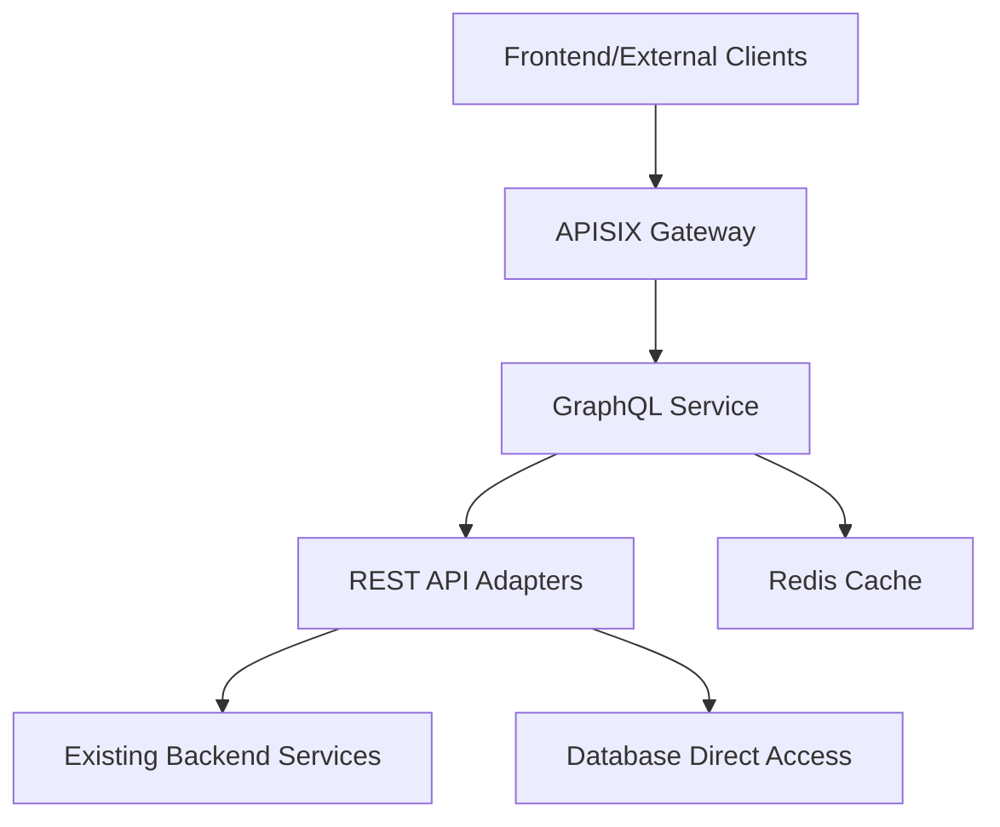
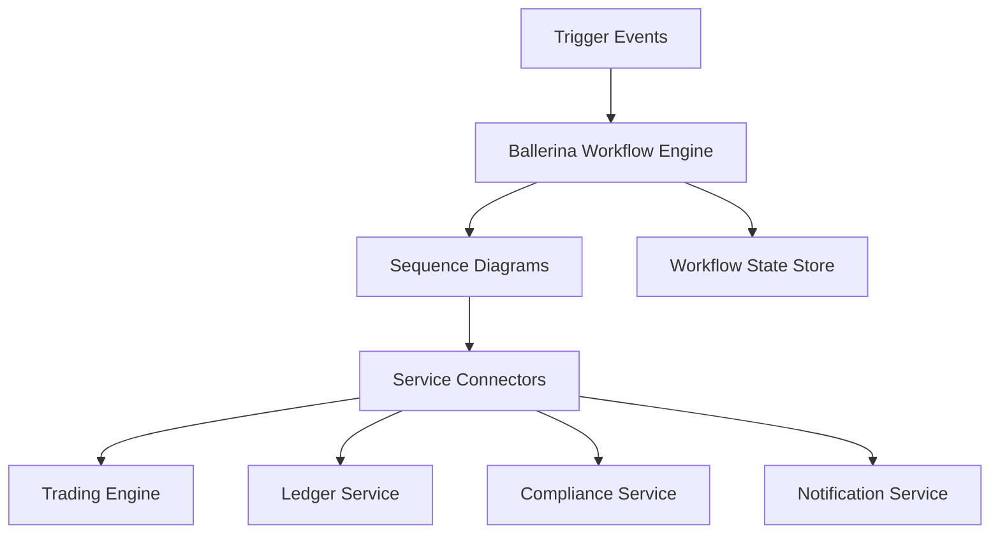
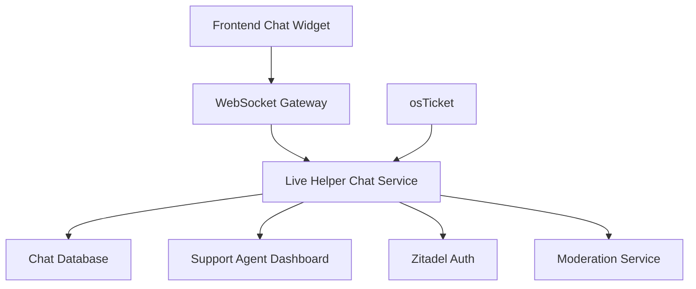
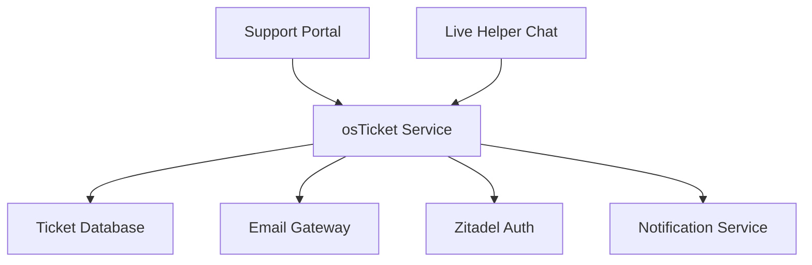
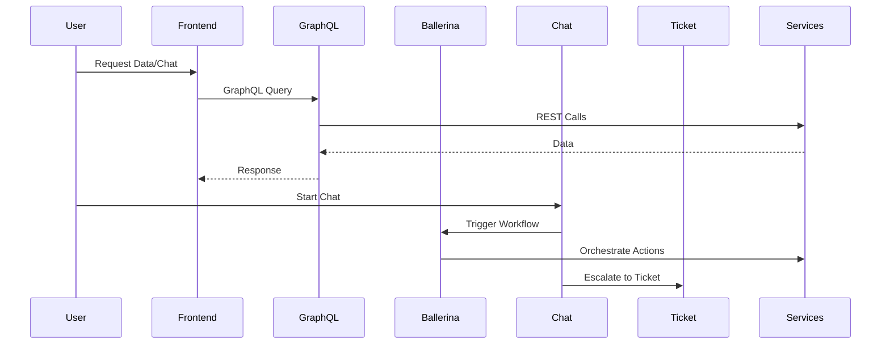

# Thaliumx Platform: Additional Components Implementation Plan

**Date**: 2026-01-02  
**Components**: GraphQL, Ballerina Workflows, Live Helper Chat, osTicket  
**Status**: Ready for Implementation  

## Executive Summary

This plan outlines the integration of four new components into the Thaliumx financial trading platform:
- **GraphQL**: Flexible API layer for efficient data querying
- **Ballerina**: Workflow orchestration for complex microservice interactions
- **Live Helper Chat**: Real-time customer support
- **osTicket**: Structured issue tracking and escalation

The additions will enhance API flexibility, workflow management, and customer support while maintaining the platform's security and performance standards.

## Current Platform Context

- **Architecture**: 27+ microservices with REST APIs, Docker Compose deployment
- **Authentication**: Zitadel OIDC
- **Gateway**: APISIX
- **Security**: OPA policies, Wazuh SIEM
- **Existing Services**: Ballerine (KYC), Blnk (ledger), trading engines, compliance systems

## Component Implementation Details

### 1. GraphQL API Gateway

#### Architecture

#### Implementation Strategy
- **Service**: New Node.js/TypeScript GraphQL service using Apollo Server
- **Schema Design**:
  - Types: User, Account, Trade, MarketData, ComplianceStatus
  - Queries: userPortfolio, marketData, tradingHistory
  - Mutations: placeOrder, updateProfile
  - Subscriptions: real-time price updates
- **Integration**: APISIX route `/graphql` with authentication middleware
- **Caching**: Redis for query results
- **Security**: OPA policies for field-level authorization

#### Deployment
- Docker service in `docker/graphql/`
- Compose integration in `production.yml`
- Environment variables for schema configuration

### 2. Ballerina Workflow Orchestration

#### Architecture

#### Implementation Strategy
- **Pilot Workflow**: User onboarding (KYC → Account Creation → Wallet Setup)
- **Language Adoption**: Gradual migration from Node.js workflows
- **Integration Points**:
  - Kafka events for workflow triggers
  - REST connectors to existing services
  - Database connectors for state persistence
- **Visual Tools**: Leverage Ballerina's sequence diagram generation
- **Error Handling**: Built-in retry and compensation mechanisms

#### Deployment
- Docker service in `docker/ballerina-workflows/`
- Ballerina runtime container
- Integration with existing Kafka messaging

### 3. Live Helper Chat

#### Architecture

#### Implementation Strategy
- **Service**: Live Helper Chat open-source deployment
- **Authentication**: Zitadel integration for user identity
- **Features**:
  - Real-time WebSocket chat
  - File sharing for documents
  - Chat history with encryption
  - Agent availability status
- **Integration**: Frontend widget, backend API for chat data
- **Security**: End-to-end encryption, PII masking

#### Deployment
- Docker service in `docker/support/`
- Database: Postgres with encryption
- APISIX routing for chat endpoints

### 4. osTicket

#### Architecture

#### Implementation Strategy
- **Service**: osTicket with fintech customizations
- **Workflow**: Chat escalation → Ticket creation → Assignment → Resolution
- **Features**:
  - Priority levels (Critical, High, Normal, Low)
  - SLA tracking for financial issues
  - Integration with email and chat
  - Audit trails for compliance
- **Customization**: Custom fields for trading-specific issues

#### Deployment
- Docker service in `docker/support/`
- Shared database with Live Helper Chat
- Email integration via SMTP

## Integration Points

### Authentication & Security
- All services integrate with Zitadel OIDC
- OPA policies for access control
- Wazuh monitoring for new services
- Encrypted data storage for chat/ticket content

### Networking
- APISIX routes for all new services
- Internal Docker network for service communication
- External access via gateway with rate limiting

### Data Flow

## Implementation Roadmap

### Phase 1: Foundation (2-3 weeks)
- [ ] Set up GraphQL service skeleton
- [ ] Deploy Ballerina runtime environment
- [ ] Configure Live Helper Chat basic setup
- [ ] Install osTicket with database

### Phase 2: Core Integration (3-4 weeks)
- [ ] Implement GraphQL schema for key entities
- [ ] Develop pilot Ballerina workflow
- [ ] Integrate chat with Zitadel authentication
- [ ] Configure ticket escalation from chat

### Phase 3: Advanced Features (2-3 weeks)
- [ ] Add GraphQL subscriptions for real-time data
- [ ] Expand Ballerina workflows to trading processes
- [ ] Implement chat moderation and analytics
- [ ] Customize ticket workflows for fintech

### Phase 4: Testing & Optimization (2 weeks)
- [ ] End-to-end testing with existing services
- [ ] Performance benchmarking
- [ ] Security audits
- [ ] Documentation updates

## Risk Mitigation

### Technical Risks
- **Performance Impact**: Monitor with existing observability stack
- **Service Dependencies**: Implement circuit breakers
- **Data Consistency**: Use event-driven architecture

### Operational Risks
- **Complexity Increase**: Enhanced monitoring and alerting
- **Team Training**: Documentation and training sessions
- **Maintenance Overhead**: Automated deployment pipelines

## Success Criteria

- GraphQL reduces API calls by 40% for complex queries
- Ballerina workflows handle 95% of orchestration scenarios
- Live Helper Chat resolves 60% of issues in real-time
- osTicket provides audit trails for all escalations
- All services maintain <100ms response times

## Next Steps

1. Review and approve this plan
2. Allocate development resources
3. Begin Phase 1 implementation
4. Schedule weekly progress reviews

---

**Prepared by**: Kilo Code (Architect Mode)  
**Approved by**: [Pending User Approval]