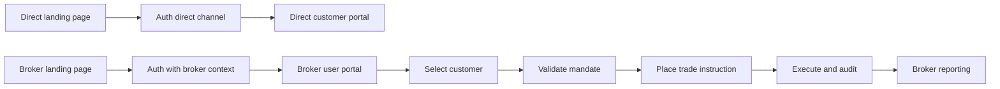

# Platform First with Broker Channel Operating Model

## Intent
- Platform direct to public is the core offering
- Broker channel is an additional distribution and execution model
- No separate tenant concept in business domain
- Each broker can have
  - own landing page
  - own customer book
  - delegated trading on behalf of customers under mandate

## Product Positioning
- Core channel
  - direct to public on platform owned brand and domain
- Broker channel
  - broker branded entry points
  - broker managed customer operations
  - broker delegated execution where mandate exists

## Canonical Domain Model

### Core entities
1. Channel
   - one of direct or broker
2. Broker
   - legal and commercial entity on the platform
   - owns brand and landing configuration
3. Customer
   - end client of a broker
   - may be platform direct customer or broker managed customer
4. BrokerUser
   - broker staff user such as adviser, trader, compliance officer
5. Mandate
   - legal authorization from customer to broker to execute actions
6. OrderInstruction
   - intent created by broker user under an active mandate
7. TradeExecution
   - execution outcome tied to mandate and broker context

### Required identity keys
- `broker_id` required in all authenticated business flows
- `customer_id` required for customer scoped operations
- `mandate_id` required for broker initiated customer trading
- `channel` one of direct, broker
- `actor_type` one of broker_user, customer, platform_operator

## Authorization Model

### Role layers
- Platform roles
  - platform_super_admin
  - platform_support
- Broker roles
  - broker_owner
  - broker_admin
  - broker_trader
  - broker_compliance
  - broker_support
- Customer roles
  - customer_primary
  - customer_view_only

### Policy rules
1. Broker users can only access customers linked to same broker
2. Direct channel users cannot impersonate broker channel roles
3. Trading on behalf requires active mandate and proper scope
4. Customer direct actions can be constrained when broker has discretionary mandate
5. Audit trail must include channel, broker_id when present, customer_id, mandate_id, actor_id

## Keycloak Design for Broker First

### Realm and clients
- Single realm for platform identity plane
- One public frontend client for web login with PKCE
- One confidential API client for backend verification and service flows
- Optional broker console client if broker portal is separated from retail portal

### Claims emitted in token
- `channel`
- `broker_id`
- `broker_slug`
- `broker_roles`
- `customer_id` optional and present for customer sessions
- `mandate_scopes` optional and present for delegated execution flows

### Why single realm still works
- brokers are business partitions not identity providers
- avoids operational overhead of realm per broker
- easier governance and consistent security controls

## Data Model Refactor Direction

## Principle
Replace semantic use of tenant with broker and channel in business tables and APIs.

### Near term compatibility
1. Keep existing physical columns where needed
2. Introduce canonical view layer using broker names
3. Add write path guard to enforce `tenant_id == broker_id` only during transition

### Target state
- Replace `tenant_id` columns with `broker_id` in domain tables
- Add `channel` to business events and auth context
- Keep platform level tables without broker scope where appropriate
- Migrations include backfill, constraints, and index rename

## Routing and Landing Pages

### Broker specific landing support
- Use broker slug in host or path
  - host model `broker-slug.platform-domain`
  - path model `/b/broker-slug`
- Resolve broker context before auth redirect
- Keycloak login can carry broker context in state and post login redirect

### Direct channel support
- keep primary platform landing and onboarding unchanged
- route direct users through default platform auth experience
- enforce no broker context leakage into direct sessions

### Broker portal requirements
1. Broker branded landing content
2. Broker onboarding flow for customers
3. Broker specific customer management screens
4. Broker specific reporting and mandate oversight

### Direct portal requirements
1. Public landing and conversion flows remain primary
2. Customer self service onboarding and trading
3. No mandatory broker association for direct users

## Customer Management Model

### Customer ownership
- direct customers have no broker association
- broker managed customers have a required broker association
- optional multi broker relationship only by explicit product rule

### Broker operations on customers
- create and manage customer profile under broker scope
- view KYC and compliance status for own customers
- execute trading actions only with active mandate

### Mandate lifecycle
1. Draft
2. Pending acceptance
3. Active
4. Suspended
5. Revoked
6. Expired

### Mandate enforcement checkpoints
- order creation
- order amendment
- cancellation
- withdrawals and transfers when delegated

## Staged Plan Broker First

## Staged Plan Platform First plus Broker Channel

## Stage 0 Domain contract freeze
1. Publish broker first glossary and canonical field list
2. Freeze new use of tenant term in app code
3. Define direct plus broker channel boundary rules
4. Define non negotiable auth claims and policy checks

## Stage 1 Identity contract in Keycloak
1. Configure realm roles and broker role groups
2. Configure protocol mappers for broker and mandate claims
3. Define broker user and customer user templates
4. Define direct customer template without broker claims

## Stage 2 API and middleware normalization
1. Introduce broker context resolver middleware
2. Introduce mandate guard middleware for delegated trading
3. Introduce channel resolver middleware for direct and broker flows
4. Add compatibility adapters where handlers still expect tenant naming

## Stage 3 Data model migration
1. Add `broker_id` to affected tables where missing
2. Backfill from existing tenant values
3. Add constraints and indexes
4. Deprecate tenant named columns in phased releases

## Stage 4 Landing and portal rollout
1. Implement broker landing route strategy
2. Add broker branding and content config
3. Launch broker customer management portal sections
4. Keep direct channel landing and onboarding as default path

## Stage 5 Control and audit hardening
1. Full mandate audit chain in all trade events
2. Broker scoped compliance reporting
3. Alerting for policy violations and scope bypass attempts

## Stage 6 Verification and go live
1. End to end tests for broker onboarding and customer lifecycle
2. Delegated trading tests with mandate edge cases
3. Cross broker isolation tests

## Fallback and Safety

### Guardrails
1. Feature flag broker first auth enforcement
2. Dual read period for tenant and broker fields
3. Rollback scripts for schema and route toggles
4. Blocking checks in CI for new tenant named fields in business domain

### Session persistence artifacts
- `plans/broker-first-operating-model.md`
- `plans/keycloak-end-to-end-staged-plan.md`
- `plans/keycloak-implementation-checklist.md`
- `plans/keycloak-auth-contract.md`
- `plans/keycloak-runbook.md`

## Mermaid Context Flow

