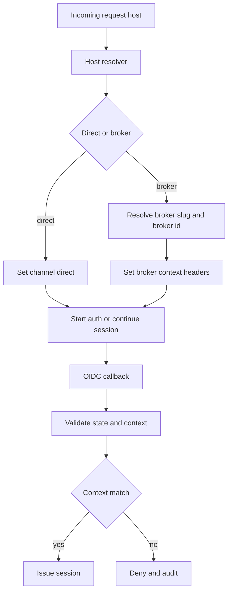

# Broker Landing Host Architecture

## Decision
Production uses host-based routing only for broker channel entry.

## Host Model
- Direct channel host
  - `platform-domain`
- Broker channel host
  - `broker-slug.platform-domain`

## Objectives
1. Resolve broker context before authentication
2. Preserve clean UX for broker-branded entry
3. Enforce strict isolation between broker sessions
4. Prevent context drift between host, token, and API requests

## Routing Contract

### APISIX host routing
1. Match incoming host
2. Resolve `broker_slug`
3. Resolve canonical `broker_id`
4. Set trusted upstream context headers

Required forwarded headers:
- `X-Channel`
- `X-Broker-Slug`
- `X-Broker-ID`
- `X-Resolved-Host`

### Channel behavior
- Direct host sets `X-Channel=direct`
- Broker host sets `X-Channel=broker` plus broker headers

## Auth Flow Contract

### Pre-auth
1. Host resolver determines channel and broker context
2. Auth initiation stores signed context
3. OIDC state contains context nonce reference

### Post-auth callback
1. Validate state
2. Re-resolve host context
3. Validate token claim consistency
4. Deny if `broker_id` mismatch

## Security Controls
1. Strict allowed host allowlist
2. Host header poisoning protections
3. Signed broker-context cache entries
4. Token claim and host context mismatch hard deny
5. Replay protection on auth state

## DNS and Certificate Requirements
1. Wildcard DNS for broker subdomains
2. Wildcard TLS certificate for broker subdomains
3. Automated certificate renewal with expiry monitoring
4. Broker host provisioning workflow integrated with DNS automation

## Broker Provisioning Flow
1. Create broker record with canonical slug
2. Reserve and validate host uniqueness
3. Publish DNS entry or wildcard routing mapping
4. Enable branding and landing configuration
5. Activate auth routing and smoke checks

## Failure Handling
- Unknown broker host
  - show safe branded fallback page
  - no auth start
- Inactive broker
  - deny sign-in for broker channel
  - include support contact path
- Context mismatch
  - deny request
  - log security event

## Observability
Track metrics and alerts for:
- unresolved broker hosts
- host and token mismatch denials
- callback state validation failures
- broker-specific auth error rate

## Dependencies
- Auth claim contract in [`plans/keycloak-auth-contract.md`](plans/keycloak-auth-contract.md)
- Broker domain model in [`plans/broker-first-operating-model.md`](plans/broker-first-operating-model.md)

## Acceptance Criteria
1. Broker host correctly resolves broker context
2. Direct host never gets broker context
3. Host and token mismatch is denied and audited
4. DNS and TLS automation documented and tested
5. Broker onboarding can activate a new host without manual route edits

## Mermaid Host Resolution Flow

