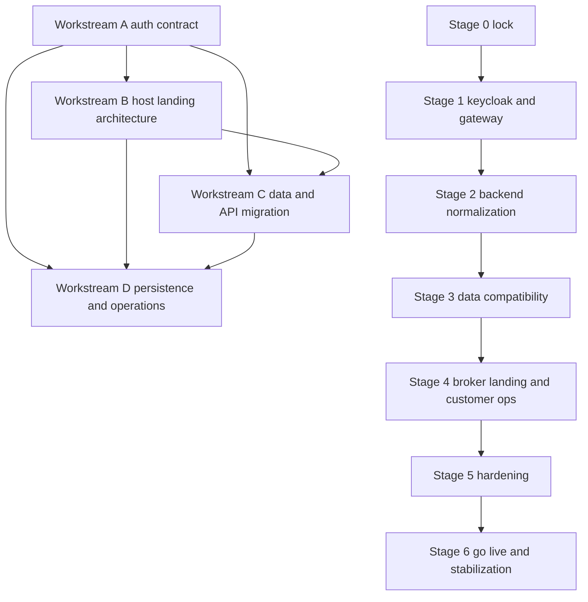

# Keycloak Broker Channel Master Plan

## Objective
Build a platform-first model with broker-channel support using Keycloak latest stable, with:
- direct to public as primary channel
- broker branded entry and broker managed customer operations
- delegated broker trading under enforceable mandate
- durable documentation for cross-session execution

## Scope of this master plan
This merges four required workstreams:
1. Auth contract and authorization policy
2. Broker landing architecture using host-based routing
3. Data migration from tenant naming to broker plus channel naming
4. Persistent execution artifacts checklist and runbook

---

## Recommended execution sequence

### Wave 0 Decision lock
Lock decisions that influence all implementation tracks before code-level rollout.

### Wave 1 Security and identity contract
Define canonical claims, roles, mandate checks, and Keycloak client model.

### Wave 2 Entry architecture
Design and lock host-based broker landing architecture and routing constraints.

### Wave 3 Data and API normalization
Execute compatibility-first migration from tenant terminology to broker and channel.

### Wave 4 Operationalization
Publish implementation checklist, runbook, and risk controls, then drive staged rollout.

Reason for this order:
- Auth contract sets non-negotiable truth for claims and policy checks.
- Landing and routing depend on auth context propagation.
- Data migration should follow canonical identity vocabulary.
- Runbooks and checklists are strongest when based on stable contracts.

---

## Workstream A Auth contract and policy baseline

### Target model
Single Keycloak realm with:
- one public web client for direct and broker channel login
- one confidential backend API client
- optional broker-ops client if broker console is separated

### Mandatory token claims
- `channel` direct or broker
- `broker_id` required for broker channel
- `broker_slug` required for broker channel
- `customer_id` for end-customer context
- `mandate_scopes` for delegated execution rights
- `roles` including platform and broker role families

### Role model
- platform roles: `platform_super_admin`, `platform_support`
- broker roles: `broker_owner`, `broker_admin`, `broker_trader`, `broker_compliance`, `broker_support`
- customer roles: `customer_primary`, `customer_view_only`

### Policy contract
1. Broker users access only customers bound to same broker.
2. Delegated trading requires active mandate plus scope match.
3. Direct channel sessions must not inherit broker context.
4. Every auditable action must include channel, broker_id when present, customer_id, mandate_id, actor_id.

### Dependencies
- none upstream
- downstream dependency for all other workstreams

### Deliverables
- [`plans/keycloak-auth-contract.md`](plans/keycloak-auth-contract.md)
- mapper matrix and role matrix appended to contract

---

## Workstream B Host-based broker landing architecture

### Decision
Use host-based routing as primary and only production pattern.

Examples:
- direct channel: `platform-domain`
- broker channel: `broker-slug.platform-domain`

### Architecture requirements
1. APISIX host routing resolves broker before auth redirect.
2. Auth initiation injects broker context into state and callback handling.
3. Post-auth session context must match resolved host broker.
4. Wildcard TLS certificate and DNS automation must be in place.
5. Broker not found should hard-fail with safe fallback page.

### Security requirements
- anti-host-header poisoning controls
- strict allowed hosts list
- broker-host to broker_id signed resolution cache
- mismatch guard if token broker claim differs from resolved host

### Dependencies
- depends on Workstream A claims and context contract
- feeds Workstream C middleware and API normalization

### Deliverables
- [`plans/broker-landing-host-architecture.md`](plans/broker-landing-host-architecture.md)
- APISIX route matrix and DNS certificate operational notes

---

## Workstream C Data and API migration tenant to broker plus channel

### Migration principle
Compatibility-first, zero-downtime oriented migration.

### Phase C1 compatibility overlay
1. Add `broker_id` and `channel` where missing.
2. Keep legacy `tenant_id` fields during transition.
3. Add write-path invariant checks in middleware.
4. Add dual-read adapters in backend services.

### Phase C2 canonicalization
1. Move business logic to broker-first naming.
2. Rename indexes and constraints to broker terminology.
3. Gate new code from introducing tenant semantics in business domain.
4. Backfill and verify historical records.

### Phase C3 deprecation
1. Remove tenant aliases only after two green release cycles.
2. Freeze and archive migration evidence.

### Critical compatibility rules
- During transition, enforce `legacy_tenant_id` mapping to canonical broker context.
- Reject writes when host broker, token broker, and request broker are inconsistent.
- For direct channel, broker_id must be null or omitted by policy.

### Dependencies
- depends on Workstream A and B
- provides data foundations for Workstream D operations

### Deliverables
- [`plans/broker-data-migration-plan.md`](plans/broker-data-migration-plan.md)
- SQL migration runbook appendix and rollback scripts catalog

---

## Workstream D Persistence docs and operational controls

### Required persistent artifacts under plans
1. [`plans/keycloak-end-to-end-staged-plan.md`](plans/keycloak-end-to-end-staged-plan.md)
2. [`plans/broker-first-operating-model.md`](plans/broker-first-operating-model.md)
3. [`plans/keycloak-auth-contract.md`](plans/keycloak-auth-contract.md)
4. [`plans/broker-landing-host-architecture.md`](plans/broker-landing-host-architecture.md)
5. [`plans/broker-data-migration-plan.md`](plans/broker-data-migration-plan.md)
6. [`plans/keycloak-implementation-checklist.md`](plans/keycloak-implementation-checklist.md)
7. [`plans/keycloak-runbook.md`](plans/keycloak-runbook.md)
8. [`plans/keycloak-risk-register.md`](plans/keycloak-risk-register.md)

### Execution controls
- stage gates with explicit go or no-go criteria
- rollback rehearsals before production
- signed-off migration evidence for each phase
- CI checks for naming contract and authorization invariants

### Dependencies
- consumes all prior workstreams

### Deliverables
- checklist and runbook documents listed above
- release readiness report template

---

## Integrated stage plan and cross-dependencies

### Stage 0 Architecture and policy lock
- finalize broker-channel domain vocabulary
- finalize auth claim and role contract
- finalize host-based routing decision

Output:
- approved architecture set from Workstream A and B

### Stage 1 Keycloak and gateway foundation
- implement realm roles, mappers, clients
- implement APISIX host-based routing and broker context pass-through
- add token-context mismatch guards

Depends on:
- Stage 0 outputs

### Stage 2 Backend normalization and mandate enforcement
- add channel resolver middleware
- add broker resolver middleware
- add mandate guard middleware
- retrofit critical endpoints with broker-first context contract

Depends on:
- Stage 1 context propagation

### Stage 3 Data migration compatibility rollout
- introduce dual fields and dual-read writes
- run backfill and validation suite
- move core services to canonical broker naming

Depends on:
- Stage 2 middleware and context checks

### Stage 4 Landing and broker customer management rollout
- broker branded landing pages on host model
- broker customer management flows
- delegated trade flows with full mandate checks

Depends on:
- Stage 1 host routing
- Stage 2 policy controls
- Stage 3 data compatibility

### Stage 5 Hardening and operations
- secret rotation and access policy
- backup and restore drills
- incident runbooks and on-call checks
- observability and alert tuning

Depends on:
- prior stages complete in non-prod

### Stage 6 Production go-live and stabilization
- canary launch broker channel
- monitor auth errors, policy denials, mandate violations
- deprecate old naming paths once stability criteria met

Depends on:
- Stage 5 readiness

---

## Go no-go criteria by stage

### Minimum go criteria per stage
- all mandatory deliverables committed under [`plans`](plans)
- automated tests green for changed contract areas
- rollback procedure tested in environment matching target
- risk register updated with residual risks and mitigations

### No-go triggers
- unresolved claim mismatch across gateway backend frontend
- unresolved broker host to token claim mismatch
- inability to demonstrate mandate enforcement at order placement
- missing backup restore evidence before production exposure

---

## Risk highlights and mitigations

1. Context drift between host, token, and request payload
- mitigation: hard validation middleware and deny by default

2. Hidden tenant assumptions in legacy code paths
- mitigation: compatibility adapters plus CI lint rule and staged deprecation

3. Broker delegated trade compliance exposure
- mitigation: mandate state machine checks plus immutable audit chain

4. Operational drift across sessions
- mitigation: mandatory session continuity protocol in checklist and runbook

---

## Session continuity protocol

At each session start:
1. read [`plans/keycloak-implementation-checklist.md`](plans/keycloak-implementation-checklist.md)
2. read [`plans/keycloak-risk-register.md`](plans/keycloak-risk-register.md)
3. mark active stage and exact next action

At each session end:
1. update checklist statuses
2. append decisions and deviations to relevant plan files
3. log blockers and fallback action

---

## Mermaid dependency map

---

## Immediate next document creation order
1. [`plans/keycloak-auth-contract.md`](plans/keycloak-auth-contract.md)
2. [`plans/broker-landing-host-architecture.md`](plans/broker-landing-host-architecture.md)
3. [`plans/broker-data-migration-plan.md`](plans/broker-data-migration-plan.md)
4. [`plans/keycloak-implementation-checklist.md`](plans/keycloak-implementation-checklist.md)
5. [`plans/keycloak-runbook.md`](plans/keycloak-runbook.md)
6. [`plans/keycloak-risk-register.md`](plans/keycloak-risk-register.md)

This order preserves dependency integrity and supports persistent cross-session execution.
