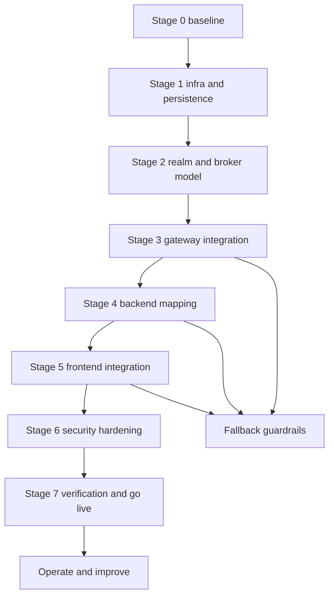

# Keycloak End to End Plan

## Scope
- Fresh environment
- Single platform tenancy model
- Multiple brokers supported inside the platform domain model
- Keycloak on latest stable release track with controlled upgrade policy

## Recommended Target Architecture

### Identity model
- One realm for the platform
- One public frontend OIDC client for browser auth with Authorization Code plus PKCE
- One confidential backend API client for token audience and service flows
- Brokers represented in realm data as groups plus broker scoped roles and broker attributes
- User to broker memberships represented by group membership and broker_id claims

### Why this is recommended
- Lowest operational complexity for a single platform
- Consistent login UX and centralized security policy
- Supports many brokers without creating realm sprawl
- Easier reporting and governance than per broker realms

### Broker authorization model
- Realm roles for global platform capabilities
- Client roles for API specific permissions
- Group hierarchy for broker segmentation such as brokers or broker-slug
- Protocol mappers to emit
  - broker_id
  - broker_slug
  - broker_roles
  - platform_roles

## Tradeoffs and Alternatives

### Option A recommended single realm with broker groups
- Pros
  - simplest operations
  - fastest delivery
  - shared policies and themes
- Cons
  - requires careful claim and role design
  - very large scale may require periodic realm hygiene

### Option B single realm with client per broker
- Pros
  - clearer broker app boundaries
  - easier broker specific redirect rules
- Cons
  - client sprawl
  - more secret rotation overhead
  - more complex APISIX and backend audience rules

### Option C realm per broker not recommended for your stated goal
- Pros
  - strongest logical separation
- Cons
  - high operations burden
  - difficult cross broker analytics and shared UX
  - longer implementation and testing cycles

## Staged Implementation Plan

## Stage 0 Governance and baseline
### Outcomes
- Confirm pinned Keycloak image tag strategy
- Confirm security baseline
- Confirm token contract for backend and frontend

### Tasks
1. Define version policy and lock the Keycloak image tag in compose
2. Define token claim contract used by backend middleware and APISIX
3. Define broker data model and canonical broker identifiers
4. Define required flows login refresh logout password reset MFA
5. Define non functional requirements audit, backup, RTO and RPO targets

### Deliverables
- Architecture decision record under `plans`
- Auth contract spec under `plans`

## Stage 1 Infrastructure and persistence foundation
### Outcomes
- Keycloak deployed with persistent database and durable storage
- Bootstrapping automated and repeatable

### Tasks
1. Add Keycloak service in prod compose with persistent Postgres
2. Add health checks and startup dependency graph
3. Add import mechanism for realm baseline config
4. Add secrets integration using Vault or docker secrets
5. Add TLS and internal CA trust where required

### Deliverables
- Keycloak compose manifests
- Bootstrap scripts and idempotent seed job
- Secret inventory and rotation runbook

## Stage 2 Realm and client design for multi broker support
### Outcomes
- Stable realm objects support brokers without code changes per broker

### Tasks
1. Create realm, platform clients, API audiences, scopes
2. Create broker group hierarchy and role templates
3. Configure protocol mappers for broker claims
4. Configure required actions and MFA policy
5. Create admin and automation service accounts with least privilege

### Deliverables
- Realm export JSON tracked in repo
- Mapper and role matrix doc
- Broker onboarding playbook

## Stage 3 Gateway integration APISIX
### Outcomes
- Gateway supports Keycloak discovery and token validation paths

### Tasks
1. Re enable keycloak branch in route seed script
2. Add provider switch guardrails for keycloak or zitadel mode
3. Validate auth route priorities so auth endpoints remain public where required
4. Configure openid-connect plugin settings for protected APIs
5. Add explicit smoke checks for issuer mismatch and JWKS failures

### Deliverables
- Updated route seeding contract
- APISIX auth verification checklist

## Stage 4 Backend integration and authorization mapping
### Outcomes
- Backend validates Keycloak tokens and enforces broker scoped RBAC

### Tasks
1. Implement provider agnostic issuer and JWKS validation wrapper
2. Add Keycloak claim mapping to internal user context
3. Enforce audience and issuer allowlist checks
4. Implement tenant and broker resolution precedence rules
5. Add authorization tests for platform admin and broker admin roles

### Deliverables
- Backend auth adapter design note
- Test matrix for role and broker scenarios

## Stage 5 Frontend integration and UX flows
### Outcomes
- Frontend uses Keycloak auth mode and stable callbacks

### Tasks
1. Implement Keycloak client initialization with PKCE
2. Wire callback route and token storage policy
3. Implement silent renew or refresh flow strategy
4. Implement logout and session expiration UX
5. Add broker context handling in app shell and API calls

### Deliverables
- Frontend auth flow doc
- End user auth acceptance checklist

## Stage 6 Security hardening and operations
### Outcomes
- Production hardening complete

### Tasks
1. Enforce strict redirect URI and CORS settings
2. Configure brute force detection and lockout policies
3. Rotate secrets and validate zero downtime rollover
4. Add audit event forwarding and alerting
5. Add backup and restore drills for Keycloak and Postgres

### Deliverables
- Security baseline checklist
- Backup restore SOP and drill report

## Stage 7 Verification and go live
### Outcomes
- End to end confidence and release readiness

### Tasks
1. Run e2e tests for login, logout, broker role gates, admin paths
2. Run failure injection tests JWKS unavailable, issuer mismatch, clock skew
3. Validate observability dashboards and alerts
4. Execute staged go live with canary users
5. Confirm post go live acceptance criteria

### Deliverables
- Release readiness report
- Go live and hypercare runbook

## Migration safe fallback path

Even with fresh environment, keep fallback controls to prevent dead ends.

1. Build provider abstraction in backend and gateway config keys from day one
2. Keep feature flag for auth provider selection without code edits
3. Maintain parallel realm contract tests for both providers where feasible
4. Keep separate issuer configs and client secrets in secret manager
5. Define rollback command sequence for gateway reseed and service restart
6. Validate rollback in non prod before production launch

## Suggested rollback guardrails
- Do not destroy previous provider config until two successful release cycles
- Keep signed backup of realm export before every auth change
- Require green status for auth smoke suite before route reseed

## Persistence across sessions

Create and maintain these files under `plans`.

1. `plans/keycloak-end-to-end-staged-plan.md`
   - primary strategy and stages
2. `plans/keycloak-implementation-checklist.md`
   - execution checklist with owner and status
3. `plans/keycloak-auth-contract.md`
   - issuer, audience, claims, role mapping, token TTLs
4. `plans/keycloak-broker-model.md`
   - broker hierarchy, roles, onboarding steps
5. `plans/keycloak-runbook.md`
   - day two operations, backup, restore, rotation
6. `plans/keycloak-risk-register.md`
   - risks, mitigations, validation evidence

## Session continuity protocol
- At start of each work session
  1. Read checklist and risk register
  2. Update status before making changes
  3. Record decisions and deviations in plan files
- At end of each work session
  1. Update stage completion state
  2. Log unresolved blockers
  3. Log exact next action for handoff

## Mermaid overview

## Approval Gate
- Plan is ready for execution once stage scope and artifacts are accepted.
